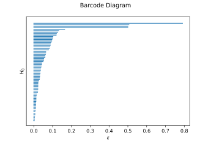

# metarelations
Using persistent homology to find structure in email metadata and sort senders into meaningful clusters.

## General info
This project tries to answer the following question:

_Is it possible to employ persistent homology to find meaningful clusters of senders and assign them labels like 'friends' or 'colleagues'?_

## Screenshots



---

## Prerequisites
The following versions of third party libraries were used:
* matplotlib - version 3.2.1
* numpy - version 1.18.4
* pandas - version 1.0.4
* scipy - version 1.4.1
* scikit-learn - version 0.23.1
* ripser - version 0.4.1
* persim - version 0.1.2

## Customization
In the configuration file, several parameter can be adjusted to individual requirements:
* Local paths for input and output of files
* A threshold for a minimum number of emails for each sender

If necessary, the format of the datum string parsed from email metadata can be adjusted manually to individual needs inside the function ```parse_datetime```.

## Features
* Support of non-euclidean metric spaces for separate features and combining them via a product metric
* Output of a persistence and barcode diagram
* Output of connected components at a specified value of epsilon
* Currently supported mailbox format: mbox

## Project Status
Project is: _experimental_ and _in progress_

---

## License
[](http://www.apache.org/licenses/LICENSE-2.0.html)

Copyright 2020 Bettina Heinlein

Licensed under the Apache License, Version 2.0 (the "License");
you may not use this file except in compliance with the License.
You may obtain a copy of the License at

    http://www.apache.org/licenses/LICENSE-2.0

Unless required by applicable law or agreed to in writing, software
distributed under the License is distributed on an "AS IS" BASIS,
WITHOUT WARRANTIES OR CONDITIONS OF ANY KIND, either express or implied.
See the License for the specific language governing permissions and
limitations under the License.